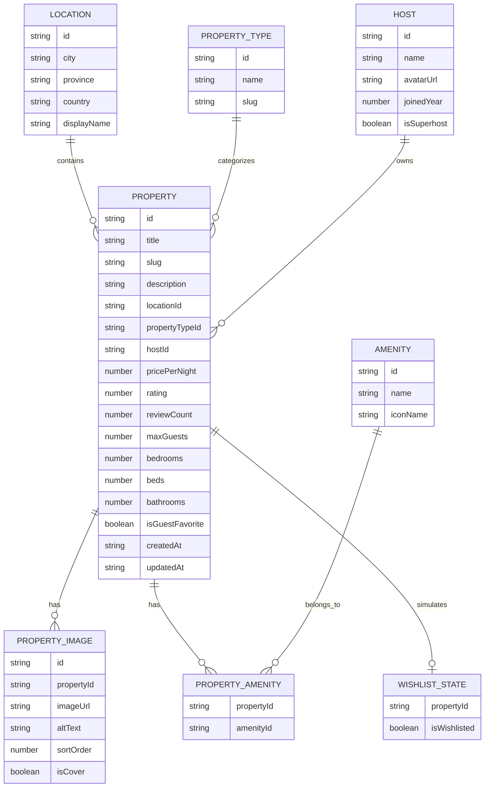

# ERD Backend Listing Properti

## Tujuan ERD

Entity Relationship Diagram dirancang untuk memodelkan domain listing properti Airbnb-like. Model ini mendukung kebutuhan listing page, detail page, search, filter, sorting, pagination, dan interaksi wishlist dummy pada frontend.

## Entity

### Property

Property mewakili data utama properti yang ditampilkan pada listing dan detail page.

Field minimal:

- id
- title
- slug
- description
- locationId
- propertyTypeId
- hostId
- pricePerNight
- rating
- reviewCount
- maxGuests
- bedrooms
- beds
- bathrooms
- isGuestFavorite
- createdAt
- updatedAt

### Location

Location mewakili lokasi properti.

Field minimal:

- id
- city
- province
- country
- displayName

### PropertyType

PropertyType mewakili kategori atau tipe properti.

Field minimal:

- id
- name
- slug

Contoh tipe properti:

- Villa
- Apartment
- House
- Cabin
- Guesthouse

### Host

Host mewakili pemilik atau pengelola properti.

Field minimal:

- id
- name
- avatarUrl
- joinedYear
- isSuperhost

### Amenity

Amenity mewakili fasilitas yang tersedia pada properti.

Field minimal:

- id
- name
- iconName

### PropertyAmenity

PropertyAmenity merupakan pivot table untuk relasi many-to-many antara Property dan Amenity.

Field minimal:

- propertyId
- amenityId

### PropertyImage

PropertyImage mewakili gambar properti.

Field minimal:

- id
- propertyId
- imageUrl
- altText
- sortOrder
- isCover

### WishlistState

WishlistState digunakan untuk mendukung kebutuhan interaksi UI. Karena backend tidak memiliki authentication pada tahap awal, wishlist hanya bersifat dummy atau client simulation.

Field minimal:

- propertyId
- isWishlisted

WishlistState tidak wajib disimpan permanen di backend. Nilai ini dapat berasal dari dataset dummy atau state simulasi pada client.

## Relasi Entity

Relasi antar entity adalah sebagai berikut:

- Satu Property memiliki satu Location.
- Satu Location dapat digunakan oleh banyak Property.
- Satu Property memiliki satu PropertyType.
- Satu PropertyType dapat digunakan oleh banyak Property.
- Satu Property memiliki satu Host.
- Satu Host dapat memiliki banyak Property.
- Satu Property memiliki banyak PropertyImage.
- Satu Property dapat memiliki banyak Amenity.
- Satu Amenity dapat dimiliki banyak Property.
- Relasi Property dan Amenity menggunakan PropertyAmenity.
- WishlistState bersifat dummy dan berhubungan dengan Property.

## Mermaid ERD

## Alasan Desain ERD

Desain ERD memisahkan data inti properti dari data referensi seperti lokasi, tipe properti, host, fasilitas, dan gambar. Pemisahan ini menjaga struktur data tetap konsisten, mengurangi duplikasi, dan memudahkan backend menghasilkan response yang berbeda untuk listing dan detail.

Relasi many-to-many antara Property dan Amenity menggunakan PropertyAmenity agar satu properti dapat memiliki banyak fasilitas dan satu fasilitas dapat digunakan oleh banyak properti. PropertyImage dipisahkan agar detail properti dapat memiliki banyak gambar, sementara listing hanya perlu menggunakan cover image untuk payload yang lebih ringan.

WishlistState tidak diposisikan sebagai fitur transaksi permanen karena tidak ada authentication. Entity ini hanya digunakan untuk mensimulasikan interaksi UI pada kedua frontend.